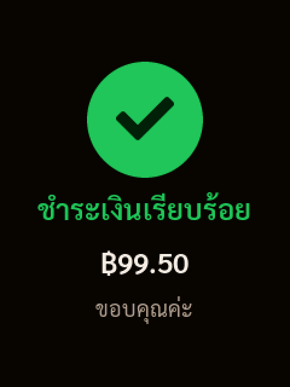
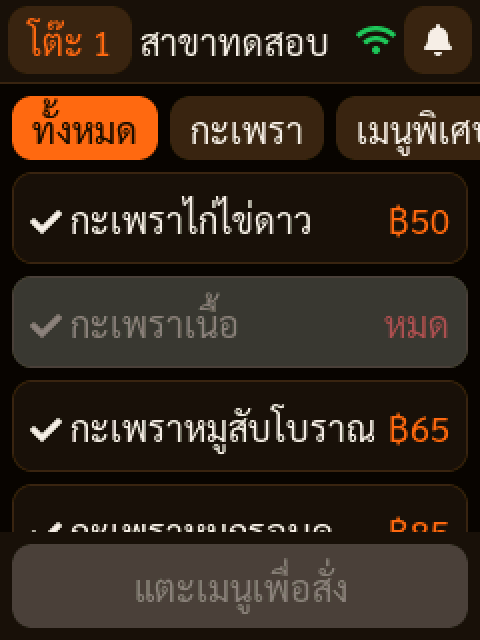
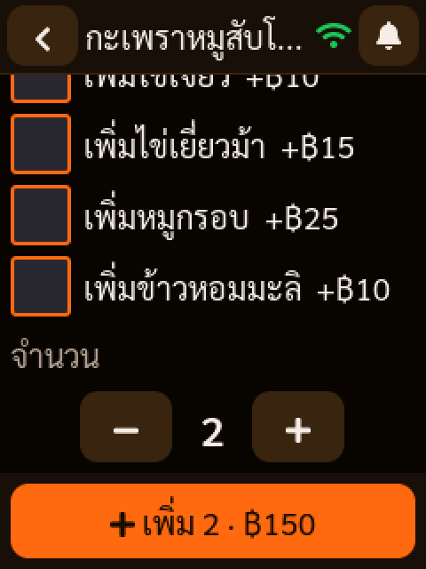
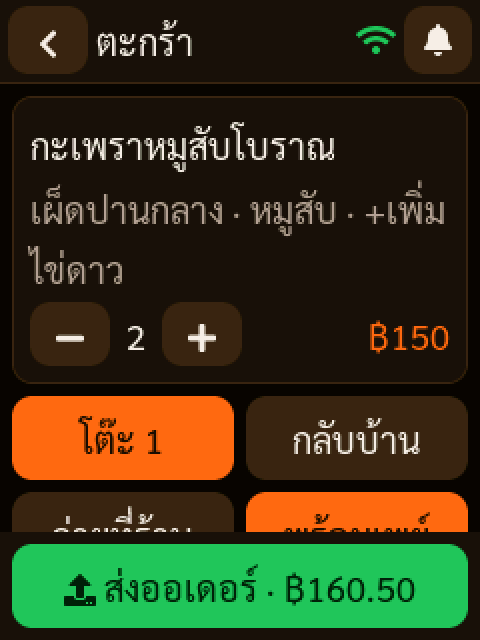
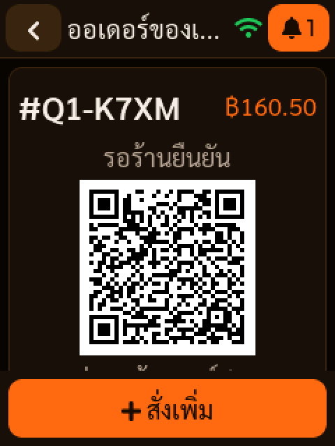
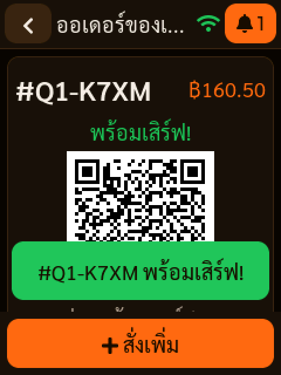
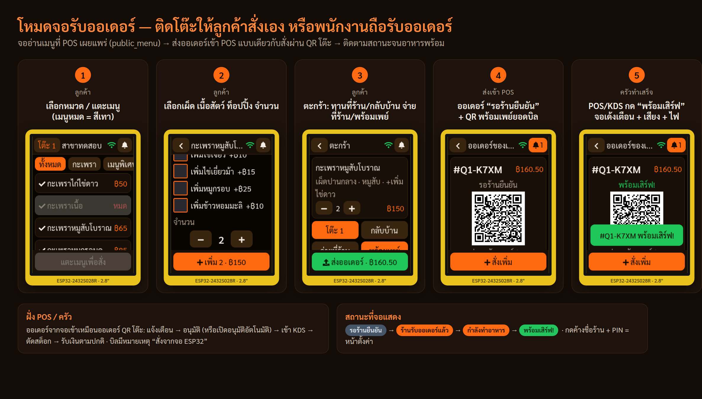
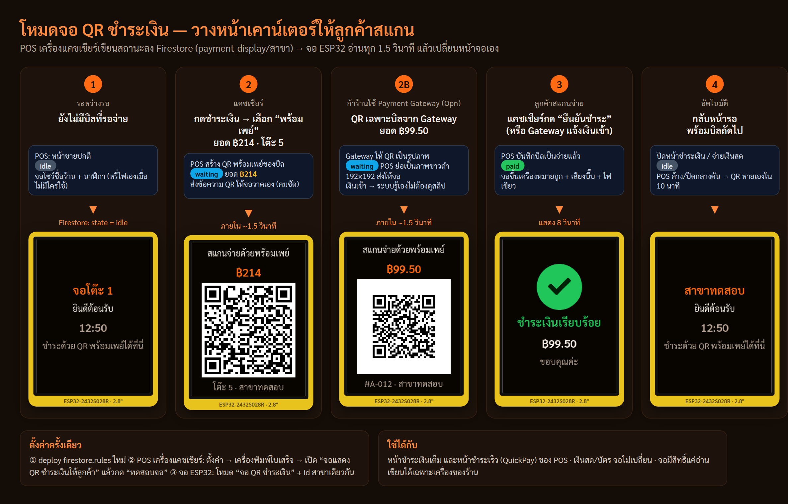

# จอรับออเดอร์ ESP32 2.8" สำหรับครัวกะเพรา POS

เฟิร์มแวร์สำหรับบอร์ด **ESP32-2432S028R** ("Cheap Yellow Display": ESP32 + Wi-Fi/Bluetooth, จอ TFT 2.8" 240×320, ทัชสกรีน XPT2046)
ทำงานกับแอป POS ตัวเดิมของร้าน (Firebase โปรเจกต์เดียวกัน) ได้ 2 โหมด:

1. **จอรับออเดอร์** — จอสั่งอาหารประจำโต๊ะ หรือเครื่องรับออเดอร์ของพนักงาน
2. **จอ QR ชำระเงิน** — วางหน้าเคาน์เตอร์ เมื่อแคชเชียร์กดรับเงินพร้อมเพย์ใน POS จอจะแสดง QR พร้อมยอดให้ลูกค้าสแกน และขึ้น "ชำระเงินเรียบร้อย" เมื่อจ่ายเสร็จ ([รายละเอียด](#โหมดจอ-qr-ชำระเงิน))

| ว่าง | QR พร้อมเพย์ | QR จาก Payment Gateway | ชำระแล้ว |
|---|---|---|---|
|  |  |  |  |

โหมดรับออเดอร์:

| เมนู | ตัวเลือก | ตะกร้า | ออเดอร์ + พร้อมเพย์ | พร้อมเสิร์ฟ |
|---|---|---|---|---|
|  |  |  |  |  |

ภาพหน้าจอได้จากโค้ด UI จริง (`src/ui.cpp` + LVGL + ฟอนต์ไทย) รันบนคอมพิวเตอร์ด้วย `test/sim/run.sh` ยังไม่ใช่ภาพถ่ายจากบอร์ดจริง (ในภาพลำดับการทำงาน กรอบจอและกล่องข้อความฝั่ง POS เป็นภาพประกอบ)

## ทำงานร่วมกับ POS อย่างไร



```
 จอ ESP32 ──(Wi-Fi, HTTPS)──▶ Firebase ◀──── แอป POS / KDS ของร้าน
   │  1. เข้าระบบแบบ anonymous (เหมือนลูกค้าที่สแกน QR โต๊ะ)
   │  2. อ่านเมนู   public_menu/{สาขา}     ← POS เผยแพร่ให้อัตโนมัติ
   │  3. ส่งออเดอร์  orders/{id}  สถานะ "pending-qr" (ยังไม่จ่าย)
   │  4. ติดตามสถานะ รอยืนยัน → รับออเดอร์ → กำลังทำ → พร้อมเสิร์ฟ
```

- ออเดอร์จากจอเป็น **ออเดอร์ QR แบบเดียวกับที่ลูกค้าสั่งผ่านมือถือ** ทุกช่องข้อมูล POS จึงแสดงแจ้งเตือน, เข้า KDS, ตัดสต็อกเมื่ออนุมัติ และรับชำระเงินได้ตามปกติ
- **ไม่ต้องแก้ `firestore.rules` และไม่ต้องแก้แอป POS** เครื่องได้สิทธิ์เท่าลูกค้า QR เท่านั้น (อ่านเมนู, ส่งออเดอร์ที่รออนุมัติ, ดูสถานะออเดอร์ของตัวเอง)
- อยากให้ออเดอร์เข้าครัวทันที: เปิดสวิตช์ **เครื่องนี้อนุมัติออเดอร์ QR อัตโนมัติ** ในหน้าออเดอร์ QR ของแอป POS (บนเครื่องที่เปิดอยู่ตลอด)
- บิลจะมีหมายเหตุ `สั่งจากจอ ESP32: <ชื่อเครื่อง>` และเลขบิลแบบ `#Q<โต๊ะ>-XXXX`
- ราคา, VAT และเงื่อนไขทั้งหมดคำนวณแบบเดียวกับหน้า QR บนเว็บ (`calculateOrderTotals`) จำกัด 40 ชิ้น/ออเดอร์ และเว้น 30 วินาทีระหว่างออเดอร์

## โหมดจอ QR ชำระเงิน



```
 POS แคชเชียร์ ──เขียน──▶ payment_display/{สาขา} ◀──อ่านทุก 1.5 วินาที── จอ ESP32 หน้าเคาน์เตอร์
   เปิดหน้าชำระเงินพร้อมเพย์   → waiting: ยอด + QR
   ได้รับเงิน / กดยืนยันชำระ    → paid: "ชำระเงินเรียบร้อย" 8 วินาที แล้วกลับหน้าว่าง
   ปิดหน้าชำระเงิน            → idle
```

- ใช้ได้ทั้งหน้าชำระเงินเต็ม และหน้าชำระเร็ว (QuickPay) ของ POS
- **พร้อมเพย์ปกติ**: POS ส่งข้อความ QR (EMVCo) ให้จอวาด QR เอง จึงคมชัด และเป็นยอดเดียวกับที่ POS แสดง
- **Payment Gateway (Opn)**: QR ของ Gateway มาเป็นรูปภาพ POS จึงย่อเป็นภาพขาวดำ 192×192 ส่งไป เมื่อ Gateway แจ้งว่าเงินเข้า จอจะขึ้น "ชำระเงินเรียบร้อย" ทันที
- จ่ายเงินสด/บัตร: จอไม่เปลี่ยน
- ถ้า POS ปิดไปกลางคัน QR จะหายจากจอเองภายใน 10 นาที

**ตั้งค่า (ครั้งเดียว)**

1. Deploy `firestore.rules` ล่าสุด (มีกฎ `payment_display` เพิ่ม): `firebase deploy --only firestore:rules`
2. แอป POS บนเครื่องแคชเชียร์: **ตั้งค่า → เครื่องพิมพ์ใบเสร็จ → จอแสดง QR ชำระเงินให้ลูกค้า (ESP32)** เปิดสวิตช์ (ตั้งแยกแต่ละเครื่อง เปิดเครื่องเดียวต่อสาขา) แล้วกด "ทดสอบจอ"
3. จอ ESP32: ตั้ง `DEVICE_MODE 1` ใน `config.h` หรือบนจอ: กดค้างที่หน้าจอ → PIN → ตั้งค่า → "เปลี่ยนเป็นโหมดจอ QR ชำระเงิน" (`BRANCH_ID` ต้องตรงกับสาขาของเครื่องแคชเชียร์ หน้าตั้งค่า POS แสดง id ให้)

**ค่าใช้จ่าย Firestore**: จออ่าน 1 document ทุก `PAYMENT_POLL_MS` (1.5 วินาที) ≈ 2,400 ครั้ง/ชั่วโมง หรือราว 29,000 ครั้งต่อวันที่เปิด 12 ชั่วโมง แพ็กเกจฟรี (Spark) ได้วันละ 50,000 ครั้ง *รวมกับการใช้งานของ POS* ถ้าใกล้เต็ม ให้เพิ่ม `PAYMENT_POLL_MS` (เช่น 3000) หรือใช้แพ็กเกจ Blaze (ประมาณ 0.06 USD ต่อ 100,000 ครั้ง)

## ฮาร์ดแวร์

บอร์ด ESP32-2432S028R (มีขายทั่วไปในชื่อ "ESP32 Arduino LVGL WIFI & Bluetooth 2.8 นิ้ว 240×320 Smart Display") ไม่ต้องต่อสายเพิ่ม

| ส่วน | ขา GPIO |
|---|---|
| จอ ILI9341 (HSPI) | SCK 14, MOSI 13, MISO 12, CS 15, DC 2, ไฟจอ 21 |
| ทัช XPT2046 | SCK 25, MOSI 32, MISO 39, CS 33, IRQ 36 |
| ไฟ RGB บนบอร์ด (active low) | R 4, G 16, B 17 |
| ลำโพง (ขั้ว SPEAK) | 26 — ต่อลำโพงเล็ก 8Ω ถ้าอยากได้เสียงเตือน |

ใช้ไฟ USB 5V (แนะนำอะแดปเตอร์ 1A ขึ้นไป) ถ้าเป็นบอร์ดรุ่น USB 2 ช่อง (CYD2USB) หรือสีเพี้ยน ให้เปลี่ยน `CYD_PANEL` ใน `config.h`

## สิ่งที่ต้องมีฝั่งร้าน (ทำครั้งเดียว)

1. แอป POS ตั้งค่า Firebase ตาม [`FIREBASE_SETUP.md`](../../FIREBASE_SETUP.md) แล้ว และเปิด **Anonymous** sign-in (ใช้ร่วมกับ QR โต๊ะอยู่แล้ว)
2. เปิดแอป POS บนเครื่องร้านที่ล็อกอินบัญชีร้าน — แอปเผยแพร่เมนูไปที่ `public_menu/{สาขา}` เอง และอัปเดตทุกครั้งที่แก้เมนู/ตั้งของหมด (ดูได้ที่หัวข้อ "เมนูที่ลูกค้าเห็นเมื่อสแกน QR" ในหน้าออเดอร์ QR)
3. หา **id สาขา**: ดูได้จากลิงก์ QR โต๊ะ (`...?table=5&b=<id สาขา>`)

## ติดตั้งเฟิร์มแวร์

ใช้ [PlatformIO](https://platformio.org/) (VS Code extension หรือ `pip install platformio`)

```bash
cd esp32/kraprao-cyd
cp include/config.example.h include/config.h   # แล้วแก้ค่าในไฟล์
pio run -t upload                                # ต่อบอร์ดผ่าน USB
pio device monitor                               # ดู log (115200)
```

ค่าใน `include/config.h` (ไฟล์นี้ไม่ถูก commit ขึ้น git):

| ค่า | ความหมาย |
|---|---|
| `WIFI_SSID`, `WIFI_PASSWORD` | Wi-Fi ร้าน (2.4 GHz เท่านั้น) |
| `FIREBASE_API_KEY`, `FIREBASE_PROJECT_ID` | ค่าเดียวกับ `firebase-applet-config.json` |
| `FIREBASE_REFERER` | ใส่เมื่อ API key จำกัด HTTP referrer ไว้ใน Google Cloud Console (ใส่โดเมนเว็บ POS) |
| `BRANCH_ID` | id สาขา (ข้อ 3 ด้านบน) |
| `DEVICE_NAME` | ชื่อเครื่องที่จะแสดงในบิล |
| `DEFAULT_TABLE` | เลขโต๊ะเริ่มต้น (`""` = ซื้อกลับบ้าน/เลือกเอง) |
| `DEVICE_PIN` | PIN เข้าหน้าตั้งค่าบนจอ |
| `LOCK_TABLE` | `1` จอติดโต๊ะลูกค้า (เปลี่ยนโต๊ะต้องใช้ PIN), `0` พนักงานถือรับออเดอร์ |
| `DEVICE_MODE` | `0` จอรับออเดอร์, `1` จอ QR ชำระเงิน (เปลี่ยนบนจอได้) |
| `PAYMENT_POLL_MS` | โหมดจอ QR: อ่านสถานะทุกกี่มิลลิวินาที (ค่าเริ่มต้น 1500) |
| `CYD_PANEL`, `SCREEN_ROTATION` | ชนิดจอ / หมุนจอ |

เปิดเครื่องครั้งแรกจะเข้าหน้า **ปรับจอสัมผัส** (แตะลูกศรตามมุมจอ) ค่าที่ได้เก็บในเครื่อง — ถ้าต้องการปรับใหม่ให้กดจอค้างไว้ตอนเสียบไฟ หรือเข้าเมนูตั้งค่า

> Arduino IDE: ใช้ได้แต่ต้องจัดไฟล์เอง (บอร์ด "ESP32 Dev Module", Partition "Huge APP", ไลบรารี lvgl 9.2.2 / LovyanGFX 1.2.0 / ArduinoJson 7.2.1, วาง `lv_conf.h` ข้างโฟลเดอร์ lvgl) แนะนำ PlatformIO ซึ่งตั้งค่าทุกอย่างไว้ใน `platformio.ini` แล้ว

## การใช้งานบนจอ

- **เมนู**: แตะหมวดด้านบนเพื่อกรอง แตะเมนูเพื่อเลือก (เมนูที่หมดจะเป็นสีเทา "หมด")
- **ตัวเลือก**: ระดับเผ็ด, เนื้อสัตว์ (บวกราคา), ท็อปปิ้ง, จำนวน → "เพิ่ม"
- **ตะกร้า**: ปรับจำนวน, เลือก ทานที่ร้าน/กลับบ้าน, จ่ายที่ร้าน/พร้อมเพย์ → "ส่งออเดอร์"
- **ออเดอร์**: ดูสถานะสด (อัปเดตทุก 10 วินาที) ถ้าเลือกพร้อมเพย์จะแสดง QR พร้อมยอดเงินให้สแกน
- เมื่อร้านรับออเดอร์/อาหารพร้อม จะมีข้อความเด้ง, ไฟ RGB และเสียงบี๊บ (ถ้าต่อลำโพง)
- **ปุ่มโต๊ะ** (มุมซ้ายบน) เปลี่ยนเลขโต๊ะ, **กดค้างที่ชื่อร้าน** → ใส่ PIN → หน้าตั้งค่า (โหลดเมนูใหม่, ปรับจอสัมผัส, ทดสอบเสียง/ไฟ, รีเซ็ตบัญชี, รีสตาร์ท)
- ไม่มีคนแตะ 2 นาที จอจะหรี่ลง แตะครั้งเดียวสว่างกลับ เมนูโหลดใหม่เองทุก 5 นาที

## ปัญหาที่พบบ่อย

| อาการ | สาเหตุ / วิธีแก้ |
|---|---|
| ค้างที่ "กำลังเชื่อม Wi-Fi" | ชื่อ/รหัส Wi-Fi ผิด หรือเป็น 5 GHz |
| "ยังไม่มีเมนูของสาขานี้" | `BRANCH_ID` ไม่ตรง หรือยังไม่เคยเปิดแอป POS ด้วยบัญชีร้าน |
| "ยังไม่ได้เปิด Anonymous sign-in" | Firebase Console → Authentication → Sign-in method → Anonymous |
| ผิดพลาด 403 ตอนโหลดเมนู | API key ถูกจำกัด referrer → ใส่ `FIREBASE_REFERER` หรือเพิ่มข้อยกเว้น |
| "ร้านไม่รับออเดอร์นี้" | ออเดอร์ผิดเงื่อนไขของ `firestore.rules` (เช่น ยอดเกิน 50,000 บาท) |
| แตะแล้วตำแหน่งเพี้ยน | ปรับจอสัมผัสใหม่ (กดค้างตอนเปิดเครื่อง) |
| สีกลับ/จอขาว | ลอง `CYD_PANEL` 2 หรือ 3 |
| จอ QR ไม่ขึ้นอะไรเลย | เปิดสวิตช์ในหน้าตั้งค่า "เครื่องพิมพ์ใบเสร็จ" ของเครื่องแคชเชียร์แล้วหรือยัง, `BRANCH_ID` ตรงกันไหม, deploy rules แล้วหรือยัง (กด "ทดสอบจอ" ดูข้อความ) |
| "ไม่มีสิทธิ์อ่านจอ QR" | ยังไม่ได้ deploy `firestore.rules` ที่มี `payment_display` |

ส่งออเดอร์ไม่สำเร็จ (เน็ตหลุด) กด "ส่งออเดอร์" ซ้ำได้เลย เครื่องใช้เลขออเดอร์เดิม จึงไม่เกิดออเดอร์ซ้ำ

## ความปลอดภัย

- ในเครื่องมีแค่รหัส Wi-Fi และ Firebase Web API key (ซึ่งเป็นค่าสาธารณะอยู่แล้ว) ไม่มีรหัสบัญชีร้าน
- สิทธิ์เท่ากับลูกค้า QR: อ่านต้นทุน/สต็อก/บัญชีไม่ได้ ส่งได้แค่ออเดอร์ที่ "รออนุมัติ" และยังไม่จ่าย
- `payment_display` อ่านได้โดยผู้ที่เข้าระบบแบบ anonymous (มีแค่ยอดและ QR ที่กำลังให้ลูกค้าสแกนอยู่ ซึ่งลูกค้าหน้าร้านเห็นอยู่แล้ว) เขียนได้เฉพาะเครื่องของร้าน
- เชื่อมต่อ HTTPS ตรวจใบรับรองกับ Google Trust Services root (`src/certs.h`)
- PIN บนจอกันแค่ลูกค้ากดเล่นหน้าตั้งค่า ไม่ใช่การป้องกันข้อมูล

## โครงสร้างโค้ด

| ไฟล์ | หน้าที่ |
|---|---|
| `src/main.cpp` | setup/loop, ไฟ RGB, เสียง, หรี่จอ |
| `src/display.cpp` | LovyanGFX (จอ+ทัช) ↔ LVGL 9, ปรับจอสัมผัส |
| `src/ui.cpp` | หน้าจอทั้งหมด (LVGL) รวมหน้าจอ QR ชำระเงิน |
| `src/cloud.cpp` | งานเครือข่ายบน core 0: Wi-Fi, NTP, Firebase Auth REST, Firestore REST |
| `src/documents.cpp` | แปลงเอกสาร Firestore ↔ เมนู/ออเดอร์ (รูปแบบเดียวกับ `buildOrderPayload` ของเว็บ) |
| `src/promptpay.cpp` | QR พร้อมเพย์ (เหมือน `src/utils/promptpay.ts`) |
| `src/thai.cpp` | จัดตำแหน่งวรรณยุกต์ไทยสำหรับ LVGL |
| `src/font_th_*.c` | ฟอนต์ Sarabun (SIL OFL) สร้างด้วย `tools/make_fonts.py` |

## ทดสอบบนคอมพิวเตอร์

```bash
npm ci                       # ที่ root ของ repo
cd esp32/kraprao-cyd && pio pkg install
test/host/run.sh             # ทดสอบกับ Firebase emulator + firestore.rules จริง (ต้องมี Java)
test/sim/run.sh              # สร้างภาพหน้าจอใน docs/screens (ต้องมี ImageMagick)
```

ฝั่งเว็บ POS: `src/utils/customerDisplay.ts` (เอกสารที่ส่งให้จอ), `src/hooks/useCustomerDisplay.ts` (ใช้ในหน้าชำระเงิน), `src/components/settings/CustomerDisplayPanel.tsx` (สวิตช์ในหน้าตั้งค่า)

`test/host/run.sh` ตรวจโหมดจอ QR ด้วย: จออ่านเอกสารที่ POS เขียนได้ ทั้ง QR พร้อมเพย์และภาพ QR ของ Gateway (ข้อมูลตรงกันทุกไบต์), หน้าชำระแล้ว และลูกค้า/จอเขียนเอกสารนี้ไม่ได้ · `test/sim/run.sh` ถ่ายภาพหน้าจอทั้งสองโหมด

`test/host/run.sh` ตรวจว่า: อ่านเมนูที่ `buildPublicMenu()` เผยแพร่ได้ครบ, ออเดอร์จากเครื่องผ่าน `firestore.rules`, ยอดรวม/VAT ตรงกับ `calculateOrderTotals()`, ติดตามสถานะได้, ส่งซ้ำได้ 409 และ rules ยังปฏิเสธออเดอร์ที่ข้ามการอนุมัติ
